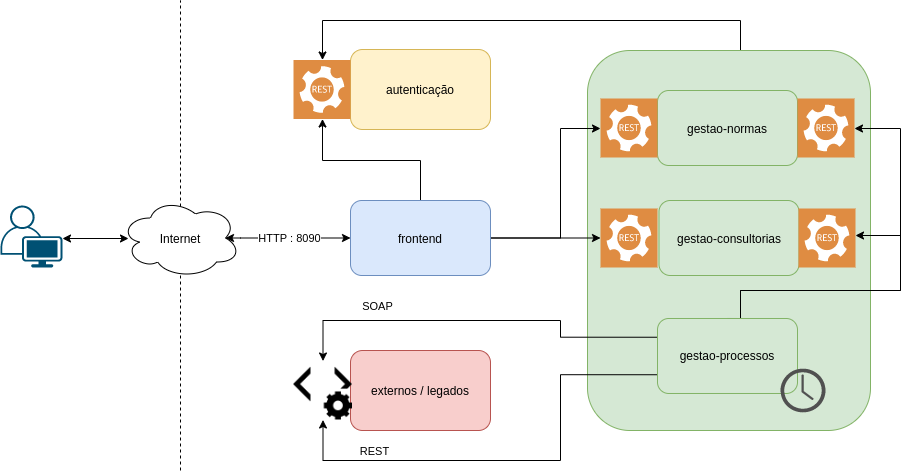

# SIGO - Sistema Integrado de Gestão e Operação

Repositório para armazenamento dos artefatos relacionados ao trabalho de conclusão do curso de **Especialização em Arquitetura de Software Distribuído** da PUC Minas.

O objetivo desse trabalho foi elaborar e validar uma proposta arquitetural para implementação de um sistema que promova a Transformação Digital de uma empresa do ramo têxtil. A validação consistiu na realização da POC (prova de conceito) para os requisitos não funcionais mais importantes do projeto.

A POC do projeto foi concebida como um conjunto de módulos baseados no conceito de microsserviços - desmembrando-os em serviços independentes que se comunicam entre si usando APIs REST - onde cada módulo possui suas responsabilidades e integrações.

## Representação simplificada da solução

## Estrutura de projeto da POC
### backend
Contém os módulos de backend da aplicação baseados na arquitetura de microsserviços. Para a POC foi escolhido o banco de dados H2, pela facilidade em fazer o drop-create em cada teste - há um script SQL para preparar minimamente a base de dados. Cada um dos módulos que fazem acesso ao repositório de dados possui sua própria instância do banco de dados H2.

### documentacao
Comtém: 
* documento de projeto arquitetural;
* os arquivos JSON e YAML para documentação das APIs seguindo a especificação da OpenAPI; 
* os diagramas UML de: Casos de Uso, Componentes e Implantação.

### external
Para representar os sistemas externos e legados, e atestar a interoperabilidade, foram criados dois sistemas mock desenvolvidos com tecnologias diferentes.
* Catálogo de Normas Mock (Javascript, Node.js, MongoDB, JSON, REST)
* ERP-Mock (Java, Spring Boot, WSDL, SOAP.)

### frontend
O front-end é uma aplicação WEB (Thymeleaf, Bootstrap) desenvolvida completamente separada dos módulos de back-end e comunica-se com eles por APIs REST e JSON. Esta aplicação é executada sob o seu próprio *middleware* Tomcat embutido no Spring boot.
### security

Arquivos para iniciar o container Docker com o módulo de autenticação que é composto por Keycloak + MySQL.
